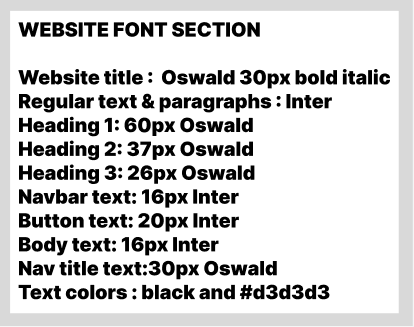
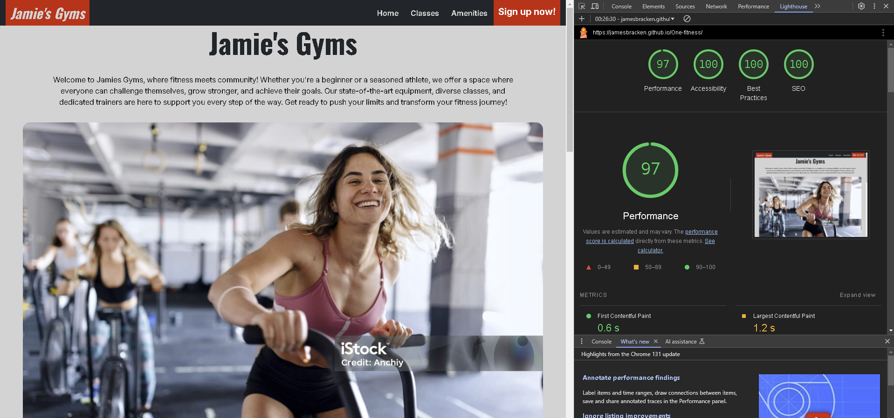

# Jamie's gyms

Welcome to Jamie's gyms, the place to get fitter, faster! I chose to build a gym website with my previous sports history, I always loved it! I built this website to welcome others into the world of sports and fitness. The website has been built with our customer base in mind, considering new fresh faces to the industry and sports enthusiasts alike. We know going into a gym can be a bit daunting for most, images that are comforting and that show the enjoyment within our gym are displayed to help ease any doubts.  

The website is split into three pages, we have the landing page, classes page and our signup page (Successful signin page included in this)

## Table of contents
- [User Experience (UX)](https://github.com/JamesBracken/Jamies-Gym?tab=readme-ov-file#user-experience-ux)
    - [Project plan of action](https://github.com/JamesBracken/Jamies-Gym?tab=readme-ov-file#project-plan-of-action)
    - [User goals](https://github.com/JamesBracken/Jamies-Gym?tab=readme-ov-file#user-goals)
    - [Business goals](https://github.com/JamesBracken/Jamies-Gym?tab=readme-ov-file#business-goals)
    - [Primary user stories](https://github.com/JamesBracken/Jamies-Gym?tab=readme-ov-file#primary-user-stories)
    - [Design](https://github.com/JamesBracken/Jamies-Gym?tab=readme-ov-file#design)
        - [Color](https://github.com/JamesBracken/Jamies-Gym?tab=readme-ov-file#color-scheme)
        - [Typography](https://github.com/JamesBracken/Jamies-Gym?tab=readme-ov-file#typography)
        - [Images](https://github.com/JamesBracken/Jamies-Gym?tab=readme-ov-file#images)
        - [Wireframes](https://github.com/JamesBracken/Jamies-Gym?tab=readme-ov-file#wireframes)
    - [Technologies](https://github.com/JamesBracken/Jamies-Gym?tab=readme-ov-file#technologies)
        - [Programming Languages](https://github.com/JamesBracken/Jamies-Gym?tab=readme-ov-file#programming-languages)
        - [Applications used](https://github.com/JamesBracken/Jamies-Gym?tab=readme-ov-file#applications-used)
- [Features](https://github.com/JamesBracken/Jamies-Gym?tab=readme-ov-file#features)
    - [User stories answering features](https://github.com/JamesBracken/Jamies-Gym?tab=readme-ov-file#user-stories-answering-features)
    - [Extra features](https://github.com/JamesBracken/Jamies-Gym?tab=readme-ov-file#extra-features)
    - [Future implementations](https://github.com/JamesBracken/Jamies-Gym?tab=readme-ov-file#future-implementations)
- [Testing](https://github.com/JamesBracken/Jamies-Gym?tab=readme-ov-file#testing)
    - [Automated testing](https://github.com/JamesBracken/Jamies-Gym?tab=readme-ov-file#automated-testing)
    - [Manual testing](https://github.com/JamesBracken/Jamies-Gym?tab=readme-ov-file#manual-testing)
- [Deployment](https://github.com/JamesBracken/Jamies-Gym?tab=readme-ov-file#manual-testing)
    - [Github pages](https://github.com/JamesBracken/Jamies-Gym?tab=readme-ov-file#github-pages)
    - [Environment variables / scripts](https://github.com/JamesBracken/Jamies-Gym?tab=readme-ov-file#environmental-variables--scripts)
- [Acknowledgements](https://github.com/JamesBracken/Jamies-Gym?tab=readme-ov-file#acknowledgements)
    - [Code used](https://github.com/JamesBracken/Jamies-Gym?tab=readme-ov-file#code-used)
    - [Tutorials](https://github.com/JamesBracken/Jamies-Gym?tab=readme-ov-file#tutorials)
- [Development life cycle]()
## User Experience (UX)

### Project plan of action

The primary goal of Jamie's gyms is to provide an intuitive, comforting and user friendly experience to current and potential clients. Jamie's gyms has two target audiences: Health conscious people and sports enthusiasts

### User goals

1. As a user I want a website that is easy to understand and navigate 
2. As a user I want a gym with an enjoyable environment
3. As a user I want large varieties of classes
4. Guidance through personal training, instructive materials and induction
5. As a user I would like to be able to pick from a selection of different gym memberships, so I can tailor my membership to my needs
6. As a user I would like to be able to easily navigate to the signup form
7. As a user I would like to get a confirmation that I have successfully signed up after making my applications for membership or newsletters

### Business goals

1. As a company I would like an intuitive UX/UI to have a smooth and enjoyable website so as to easily translate new users into new clients
2. As a company I want to clearly and descriptively convey all of my business offers to widen and drive potential client interest 
3. As a company I want a CTA that stands out, is immediately displayed on open of the webpage and is ALWAYS visible so it's always easily accessible for my potential clients

### Primary user stories

1. As a new user I would like to easily be able to navigate to the gym sign up to apply for a gym membership
2. As a user I would like to be able to quickly see any potential for discounts or savings within the gym
3. As a Fitness enthusiast I would like to be able to see detailed information of the different classes available to customers so I can decide if this is the right gym for me
4. As a fitness enthusiast I would like to be able to see what amenities and other services the gym has to offer other than weight lifting and excercise
5. As a new user, I would like to be able to start out my gym journey by booking a gym induction, so I am able to learn how to use gym equipment safely
6. As a First-time visitor, I would like to be able to navigate to different parts of the website with relative ease, so I can find the information I need without frustration Additionally the website should be responsive across multiple devices.
7. As a user I would like to be able to book classes at the click of a button so I can come whenever I want
8. As a new potential customer I would like to be able to see reviews from past gym guests to understand how others experience was within the gym

### Design

#### Color Scheme

I chose the color ivory as the main color on the website, it matches the many bright colors shown on all images. Additionally I wanted mostly warm, bright colors to convey a comforting look. I used red as a color to create focus on certain elements which I want people to look at such as our CTA signup button. I alsosubtly adjusted the background color to a ivory. Celadon was originally used for the nav and footer, however I forfeited this color as it didnt mesh well with the rest of the site.

#### Typography

For fonts I went for Oswald for headings and inter for other text. They both go well together and give a cool calm look. If there are any import issues fall backs have been added as sans-serif

#### Images

I chose images with our customers in mind, going into a gym can be a bit of a daunting task for some. We have to make sure that we display the fact that once you get into it, fitness is loved by all and it can be something everyone can enjoy. We show people enjoying themselves, having fun and reaping the benefits. We also display a few pictures which shows the heavy lifting for the truly hardcore gym enthusiasts, heavy deadlifts, martial arts classes whats not to love?I also aimed to implement similar contrast pictures to the website colors. This helped to blend well within the website.

Images were resized and compressed through [Tinyjpg](https://tinyjpg.com/) to optimize load times of the website without destroying image quality. Some images like the hero image were minimally compressed as this stands out and we do not want to reduce quality here.

#### Wireframes
I made my wireframes using figma, this was then molded and made into my websites, original designs on these figma wireframes have been tweaked. Specifically the colors within the website was changed due to celadon not being very fitting within the webpage

- [Home page](https://www.figma.com/design/jfDJvLOJmi6vmutUj6emFR/Instagram-UI-Practice?node-id=0-1&m=dev&t=Rk9vMcX76FpvQDS6-1) 
- [Classes page](https://www.figma.com/design/jfDJvLOJmi6vmutUj6emFR/Instagram-UI-Practice?node-id=160-2112&m=dev&t=Rk9vMcX76FpvQDS6-1)
- [Signup page](https://www.figma.com/design/jfDJvLOJmi6vmutUj6emFR/Instagram-UI-Practice?node-id=98-126&m=dev&t=Rk9vMcX76FpvQDS6-1) 

### Technologies
#### Programming Languages
* [HTML5](https://en.wikipedia.org/wiki/HTML5)
* [CSS3](https://en.wikipedia.org/wiki/CSS)
* [HTML5](https://en.wikipedia.org/wiki/JavaScript)

#### Applications used

1. [Visual studio code](https://code.visualstudio.com/) - My personal IDE of choice
2. [Figma](https://figma.com/) - Used for my wireframes 
3. [Github](https://github.com/) - Site deployment and allows others to see my site
4. [Am I responsive](https://ui.dev/amiresponsive) - Shows my site on multiple screen sizes
5. [Google fonts](https://fonts.google.com/)- To import my fonts
6. [Tiny Img](https://tinyjpg.com/) - to optimize my images

## Features

### User stories answering features
**Story 1** As a new user I would like to easily be able to navigate to the gym sign up to apply for a gym membership

Our signup button is visible no matter where you are on the page or which page you are on, you will always be able to see it. The button also stands out from other elements on the page, making sure that our users can find it very easily.

**Story 2** As a user I would like to be able to quickly see any potential for discounts or savings within the gym

Right on the home page you will be able to see the discount section very quickly as you scroll down the page, displaying a great offer for all of our clients.

**Story 3** As a Fitness enthusiast I would like to be able to see detailed information of the different classes available to customers so I can decide if this is the right gym for me

We have a dedicated classes page showing of our variety, quality and quantity of classes. Each class is shown with an image, description and class times giving the user everything they could ever need to decide what is the right fit for them.

**Story 6** As a First-time visitor, I would like to be able to navigate to different parts of the website with relative ease, so I can find the information I need without frustration. Additionally the website should be responsive across multiple devices.

### Extra features

**Gym logo** 

The logo, one of the main components of every webpage, its one of the things users remember you from. Our logo stands out from the webpage, therefore easily seen. You can also click it at any point to return to the home page during your visit to our website

**Navbar** 

Our navbar used bootstrap technology to efficiently but elegantly be placed in our website. It sports the gym logo on the left and links to other pages on the right, including our call to action signup button! The navbar is always visible wherever you are on the website and fully responsive, collapsing into a dropdown menu for our mobile users.

**Hero image** 

Our hero image brings a happy, comforting, energetic and bright vibe to our users, as going to the gym can be a daunting task this is a vital part of why we chose this image.

**Footer**

We have our footer displaying vital information for our users, clearly displaying the gym opening and closing times within a table. We also have our contact information displayed here, as well as our social media. Given the importance of social media platforms nowadays for customer acquisition and company exposure we made sure to include a variety of different platforms and they are easily accessible, you can just click on the icons.(These links are ofcourse leading to the home pages of these social media sites, not real company pages)

**Classes card**

Our classes card gives our users a little insight of what we offer in terms of classes. Fully responsive and leads up to our classes page.

**Success page**

A success page displays when we finish filling out our form, this confirms to our users that they have finished signing up for our website.

**404 page**

In the case where a user is led to a page which doesnt exist we have our 404 page. The user can easily click the navigate button to go back home or our logo can also lead them back to safety.

**Yoga class video** 

Giving a little insight into our gym classes is crucial, we have placed a short video in the classes page displaying to our user what one of our fantastic yoga classes looks like. The videos fullscreen has been purposefully disabled as the is not the intended purpose of the video, and quality is not high enough to have high quality on some screens on full screen.

### Future implementations

**Story 4** As a fitness enthusiast I would like to be able to see what amenities and
other services the gym has to offer other than weight lifting and excercise

An amenities section can be made futurewise displaying our fantastic selection within the gym. This will have its own dedicated page to showoff everything required.

**Story 5** As a new user, I would like to be able to start out my gym journey by booking a gym induction, so I am able to learn how to use gym equipment safely.

A form delived either on the home page, in a modal or on its own dedicated page will be added for our users to be able to safely and properly use our equipment.

**Story 7**  As a user I would like to be able to book classes at the click of a button so I can come whenever I want

A system wherein users are able to book their spot in a class ahead of time so that they can rest easy that their spot in the class is there.

**Story 8** As a new potential customer I would like to be able to see reviews from past gym guests to understand how others experience was within the gym 

Displaying reviews instills trust and gives a taste of things to come, so that new users can have a better understanding if this is the right fit for them. A reviews section will be added relatively near to the bottom of the page displaying constructive criticism, feedback and experiences from our customers.
## Testing

### Automated testing

#### HTML validator
My html code initially showed up with a few issues such as 
- Nesting a button tag in an anchor
- Nesting a div in a ul

I fixed these issues and no further problems were present on all pages

#### CSS Validator
I ran my code through a CSS validator and was delighted to see no validator issues

#### Lighthouse

After passing my project through lighthouse I got the below scores, very near perfect. The hero image unfortunately takes up some performance points but if optimized further becomes pixelated so I left it as is

### Manual testing

#### Browsers

|Browser|Not Functioning|Partial Functioning|Full Functioning|
|-------|---------------|-------------------|----------------|
|<i class="fab fa-chrome"></i>Google Chrome| | |✅Pass|
|<i class="fab fa-firefox-browser"></i>Mozilla Firefox| | |✅Pass|
|<i class="fab fa-edge"></i>Microsoft Edge| | |✅Pass|
|<i class="fab fa-opera"></i>Opera| | |✅Pass|

Research data displayed these being the most used browsers with the exclusion of safari. All aspects and elements of the website worked without issue on all browsers.

#### Responsiveness

|Screen Size|Device Type|Viewport Width|Pass/Fail|
|-----------|-----------|--------------|---------|
|Mobile|Smartphone|320px|✅Pass|
|Tablet|Tablet |768px|✅Pass|
|Laptop|Small Laptop/Desktop|1024px|✅Pass|

#### Navbar
|Feature|Expected Outcome|Testing Performed|Result|Pass/Fail|
|-------|----------------|-----------------|------|---------|
|Navbar |Visible all throughout each page | Scrolled each page | Navbar is constantly visible|✅Pass |
|Navbar Hamburger Icon |On mobile screen sizes nav links are consolidated into a hamburger icon |Resized viewport to 320px (standard mobile width) |Burger icon replaces links |✅Pass |
|Navbar Hamburger Icon |On click this acts as a drop down menu and displays the hidden options  | Clicked the burger icon | Menu expanded and displayed options |✅Pass |
|Navbar Logo| On click the user is brought to the top of the home page|Clicked the logo from other pages| Website returned to the home page|✅Pass|
|Navbar links| On hover of links text color changes|Hover over all links|Text color changes|✅Pass|
|Navbar links| On hover of the logo the text color changes|Hover over the logo|Color of the text changes|✅Pass|
|Navbar Classes| On click of this links I should be brought to the Classes page|Clicked the links|I am brought to the Classes page|✅Pass|
|Navbar Home| On click of this links I should be brought to the Home page|Clicked the links|I am brought to the Home page|✅Pass|

#### Home Cards section
|Feature|Expected Outcome|Testing Performed|Result|Pass/Fail|
|-------|----------------|-----------------|------|---------|
|Cards|Cards consolidate and respond well to changes in screen sizes|Checked the cards on 3 major screen sizes 320, 768 and 1024 px|All pages look good on all screen sizes|✅Pass|
|Sign up button|On click the user is brought to the sign up page|Button is clicked|User is brought to the sign up page|✅Pass|
|Classes button|On click the user is brought to the classes page|Button is clicked|User is brought to the classes page|✅Pass|
|Buttons|On hover there should be an indication that I am hovering|I hovered my mouse over the button|The buttons text change color|✅Pass|

#### Footer
|Feature|Expected Outcome|Testing Performed|Result|Pass/Fail|
|-------|----------------|-----------------|------|---------|
|Responsiveness|Information is displayed well on different screen sizes|Page is expanded and contracted|Information is shown well and structured on all sizes tested|✅Pass|
|Social media links|Open the correct media link for the clicked icon|Clicked icons| The correct social media platforms were opened|✅Pass|
|Social media links|On hover the links change color|Hovered over links|The links changed color|✅Pass|

#### Classes page
|Feature|Expected Outcome|Testing Performed|Result|Pass/Fail|
|-------|----------------|-----------------|------|---------|
|Responsiveness|All elements accross the site stretch, contstrict and grid system is working as intended|Window resized|All elements resized correctly |✅Pass|
|Video|On click of the mute control video audio stops if playing/ on play and starts|Video mute control toggled off and on|Video audio stops or does not start on play and works again on toggle|✅Pass|
|Video|On click of the play button video starts and stops|Play and pause button clicked|Video starts and stops|✅Pass|
|Video|On click of the full screen button the button does not work, this has been disabled due to insufficient video quality for fullscreen on some screen sizes|Fullscreen control clicked|Video does not become full screen|✅Pass|

#### Sign up page
|Feature|Expected Outcome|Testing Performed|Result|Pass/Fail|
|-------|----------------|-----------------|------|---------|
|Membership cards responsiveness|Cards display correctly by row in 768px+|Window sized to 768+|Cards show correctly|✅Pass|
|Membership cards responsiveness|Cards display correctly by column in 767px or less|Window resized to less than 768px|Cards show correctly|✅Pass|
|Form responsiveness|Form inputs grid system working as expected |Window resized|Form inputs are adjusting based on given screen size|✅Pass|
|Form validation|Empty fields are prompted with a warning|Fields are left empty and submit button is clicked|User is prompted with a warning to fill in the required fields|✅Pass|
|Form validation|If an @ symbol is missing in the email the user is prompted with a warning| Email without an @ symbol is placed and submit button clicked|The user is prompted to include an @ symbol|✅Pass|
|Form validation|If nothing is followed by the @ the user is prompted to fill out the last portion of the email address|Text and an @ is placed in the input and the submit button clicked|The user is prompted to enter the last part of the email address|✅Pass|
|Form validation|If a user does not select one of our memberships the user is prompted to select an option|No option is selected and the submit button is clicked|The user is prompted to select and option from the list|✅Pass|
|Form validation|If a user does not click the checkbox and agree to the terms and conditions the user is prompted to tick the box|The box is not ticked and submit button is clicked|The user is prompted to tick the box to proceed|✅Pass|
|Submit button|If the form is filled out correctly the form will be posted and the user will be led to the success page|The form is filled out correctly and the submit button clicked|The form is posted and the user has been led to the success page|✅Pass|

#### Success page
|Feature|Expected Outcome|Testing Performed|Result|Pass/Fail|
|-------|----------------|-----------------|------|---------|
|User feedback|The user is shown a success message that they have successfully signed up|The form is finished and submit button clicked|The user is led to a page which gives them feedback that they have successfully signed up|✅Pass|
|Home page button|The user should be able to click the home page button and be redirected to the home page |The home page button is clicked|The user is redirected to the home page|✅Pass|

#### 404 page
|Feature|Expected Outcome|Testing Performed|Result|Pass/Fail|
|-------|----------------|-----------------|------|---------|
|Page is responsive|Page is readable and works on multiple screen sizes|Window resized|Page information is properly displayed across multiple screen sizes|✅Pass|
|Incorrect links|If an incorrect link is used the 404 page will be displayed|Incorrect page is requested| 404 page is displayed|✅Pass|
|Home button|Without using the browser back buttons the user is able to navigate back to the home page|The click me to go home button is clicked|The user is sent back to the home page|✅Pass|

## Deployment

### Github pages
This website is deployed on github pages - [Jamie's Gyms](https://jamesbracken.github.io/Jamies-Gym/)

How to deploy a site using GitHub Pages:

1.Create a github account
2.Sign in to github
3.Click on settings
4.Go to your project repository - [Jamie's Gyms](https://jamesbracken.github.io/Jamies-Gym/)
5.Choose *Pages* in the navigation menu on the left side of the screen
6.In the source dropdown, Make sure you are on *main* branch and then click on save

After you have completed all these the website will start to be constructed by github pages, following this you will be able to open your page from the home page of your repository on the right side within the *Deployments* section

**Forking** 
To fork this repository follow these steps

1.Setup Git and make sure your git has github authentication
2.Go to the web page repository [Jamies Gyms](https://github.com/JamesBracken/Jamies-Gym) 
3.Click on *fork* on the upper right portion of the page.
4.This has now forked the repository to your own profile. 
5.Go to your profile and navigate to the forked repository.
6.Click on *Code* above the list of forked files
7.Choose the option you need from the dropdown menu. 

Further assistance can be found [HERE](https://docs.github.com/en/pull-requests/collaborating-with-pull-requests/working-with-forks/fork-a-repo) on the github Fork a Repo page
### Environmental variables / scripts
This webpage does not require any environmental variables or scripts

## Acknowledgements

### Code used
I did not use any code from any sources except the bootstrap library, comments are added for any bootstrap library code used

### Tutorials

[W3schools](https://www.w3schools.com/) Used them to read and learn more about specific code which I needed to understand further

[Codeinstitute](https://www.w3schools.com/) Using code institute videos I followed some of the structure for readme files

## Development life cycle

I tracked the development of the project through a gantt chart I made using google sheets. The dates on the top, tasks on the left and green representing when the task was being worked on.
Noticeably the work is separated into 2 with the black columns. The work was initially done in November 2024 and revisited and slightly altered in January 2025, therefore was separated for clarity.

